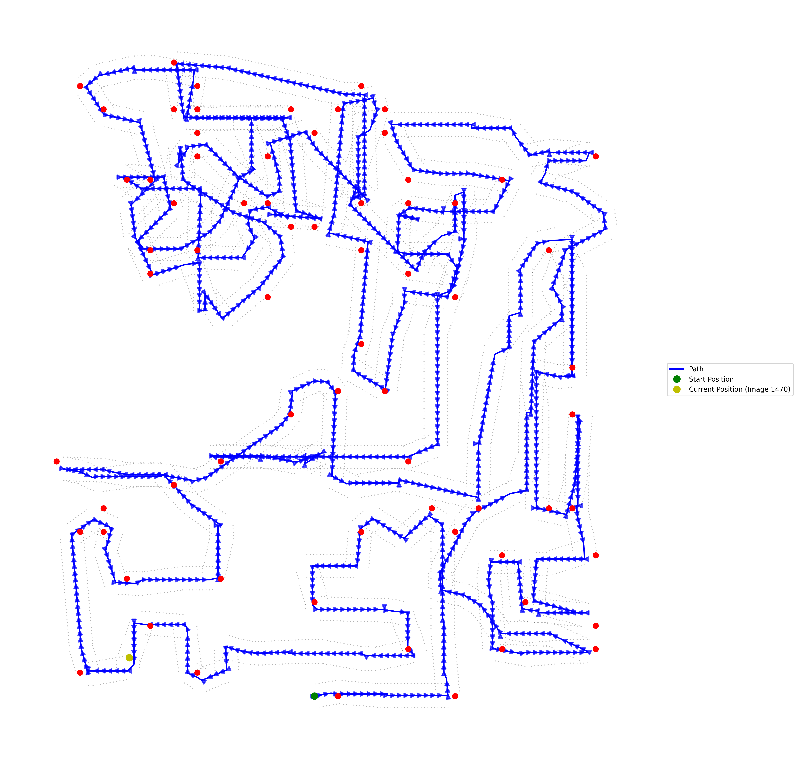

# 目前的解决方案

运行`python track.py`，只需要依赖`matplotlib`，可能需要修改main函数中的json文件位置和目标图像序号，可以得到如下的轨迹图像：

我也尝试了使用`baseline_updated.py`去做slam，但是效果相当差，根据ai的说法，如果只有旋转没有位移，那么视觉里程计(visual odometry)双视图几何（对极几何, epipolar geometry）中的基础矩阵(fundamental matrix)和本质矩阵无法使用，只能通过单应矩阵(homography matrix)去进行计算。由于在游戏中既有位移也有单独旋转，我不知道怎么做才好。如果可以的话可以帮忙看一下代码。

另外，似乎有库可以做slam，库的名称是`pyslam`。但是它好像只能生成3d的。